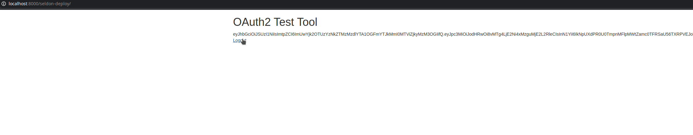

# Oauth2 Test Tool

This tool is for testing login to Oauth systems. The code has been checked with dex, keycloak and active directory, including retrieval of custom ID claims such as email and groups.
 
It is based on https://github.com/jlubawy/go-azure-ad, which is an Active Directory OAuth example in Go. It contains a UI for logging in.

The tool can be run locally, in docker or in kubernetes. The paths and port can be adjusted so you can replace your apps image with this one for testing.



## Configuration

OIDC_PROVIDER is optional. If set not set then AUTH_URL and TOKEN_URL will be used instead.

CLIENT_SECRET is also optional as it is not always required.

## Debug Info

The access token is displayed if the login is successful. The full raw token, including the id token, is printed in the logs.

## Local

Build go with `go build .`

Run locally with `source env.sh && ./go-azure-ad`

# Docker
 
Build and run docker with 
```
docker build -t ryandawsonuk/go-azure-ad:test .
docker run --env-file env.list -p 8000:8000 ryandawsonuk/go-azure-ad:test
```

# Kubernetes

Either construct a standard kubernetes Deployment yaml file or do `kubectl run`. You will need to set port and env vars. See env var files.
